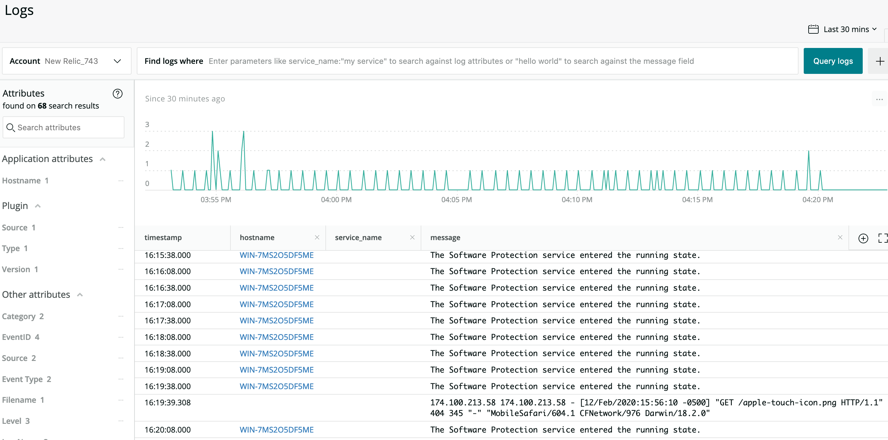

# Deprecation notice
Collection of event log channels is now part of core New Relic Infrastructure Agent:
https://docs.newrelic.com/docs/logs/enable-log-management-new-relic/enable-log-monitoring-new-relic/forward-your-logs-using-infrastructure-agent#winlog

# Windows Event Log Integration

* Pipes Windows PowerShell `Get-EventLog` entries to New Relic Logs.
* Configurable through Infrastructure config file.

Information about each run (number of Windows events posted, etc) are added to Insights as events of type winEventLogAgt.

This integration requires New Relic Infrastructure 1.8.0 or newer.

## Instructions

1. Copy .zip from Releases to host you'll be running on.

2. Unzip files.

3. Copy `newrelic-win-eventlog-config.yml` to `C:\Program Files\New Relic\newrelic-infra\integrations.d`

4. Copy the remaining files to `C:\Program Files\New Relic\newrelic-infra\custom-integrations`

    a. `win-eventlogs-logs.bat`
    b. `win-eventlogs-logs.ps1`

5. Open newrelic-win-eventlog-config.yml with your favorite editor.

6. By default, the integration collects all Application and System event log entries.  Each log type has its own stanza.  At minimum, you need to edit the file to add your New Relic license key.  See the template file for complete docs.

7. Run: `net stop newrelic-infra`

8. Run: `net start newrelic-infra`
